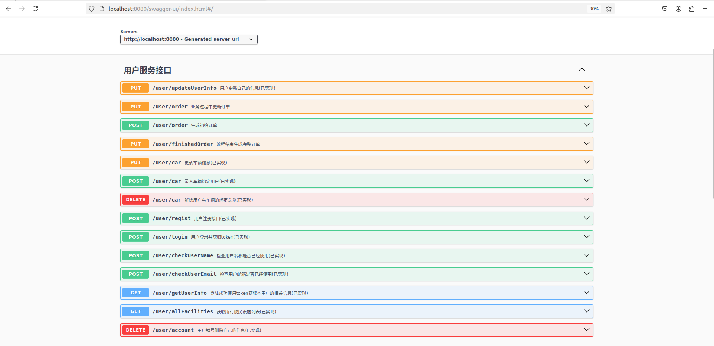
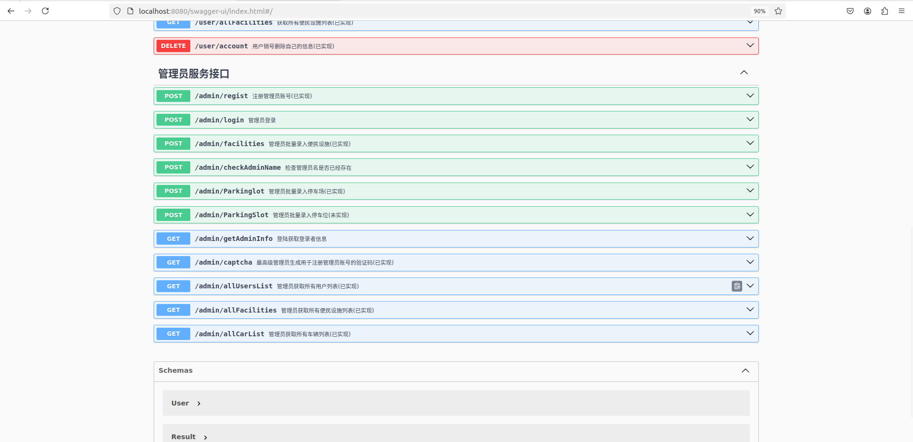

# SoftWarePratice(Parkinglot Management System)

## 整体设计概述

**系统功能按照角色划分为两大模块**：

1. 用户模块：面向普通用户，功能以查询、互动和个人信息管理为主。
2. 管理员模块：分权限级别，负责系统管理、反馈处理及数据分析。

### 功能模块设计

#### 用户模块
- [x] 用户注册与登录

    - [x] 注册：通过 UserController 提供用户注册接口，使用密码加密（如 BCrypt）。
    - [x] 登录：JWT（JSON Web Token）实现无状态身份认证。
- [x] 停车场信息查询
    - [x] 提供停车场列表和详情查询接口，包括停车位状态、价格、营业时间。
    - [x] 附近设施查询。
- [x] 个人信息管理
    - [x] 提供用户信息更新接口（如修改邮箱、头像）。
    - [x] 车辆绑定：支持新增、修改或解绑车辆。
- [ ] 用户评论（反馈）
  - [ ] 用户对停车场或设施发表评论。
  - [ ] 支持多层评论（回复功能）。
- [ ] 管理员模块
  - [x] 权限分级管理
  - [x] 最高级管理员（Super Admin）：能创建、删除、管理低权限管理员。
  - [ ] 普通管理员：仅管理指定资源。
- [ ] 用户评论管理
  - [ ] 查看所有评论，回复用户反馈。
  - [ ] 支持批量操作（如隐藏违规评论）。
- [x] 停车场和设施管理
  - [x] 增删改查停车场信息（包括停车位数量、价格、位置）。
  - [x] 管理便民设施（设施名称、状态、位置等）。
- [ ] 用户使用停车场的订单系统
  - [x] 生成初始订单填入必要信息
- [ ] 数据报表与分析
  - [ ] 生成停车场使用率统计报表。
  - [ ] 生成收益和停车流量报表。
  - [ ] 支持按时间维度（如每日、每月）导出数据。
- [ ] 日志功能
  - [ ] 记录用户有对数据库产生影响的所有事件
  - [ ] 记录管理员的所有操作
  - [ ] 记录所有已完成的**完整订单**
## DataBase Used in This Troject
[本项目使用的数据库创建语句](./DevelopmentDOC/db.sql)
### Interface Between Front and Backend 

[运行程序后于 http://localhost:8080/swagger-ui.html 查看接口文档](http://localhost:8080/swagger-ui.html)



## Deploy

> 所需环境： `jdk_21+`,`maven_3.9+`

创建springboot配置文件
```bash
touch ./src/main/resources/application.yaml
```

填写springboot配置文件

```yaml
# server配置
server:
  port: 8080
  servlet:
    context-path: /Your/Root/Path

# 连接池配置
spring:
  datasource:
    type: com.alibaba.druid.pool.DruidDataSource
    druid:
      url: jdbc:mysql://[dbUrl]:[dbPort]/[dbName]
      username: username
      password: password
      driver-class-name: com.mysql.cj.jdbc.Driver

# mybatis-plus的配置
mybatis-plus:
  type-aliases-package: com.chy.pojo
  global-config:
    db-config:
      logic-delete-field: isDeleted  #全局逻辑删除
      id-type: auto #主键策略自增长
#jwt配置
jwt:
  token:
    tokenExpiration: 120 #有效时间,单位分钟
    tokenSignKey: nihao123  #当前程序签名秘钥 自定义
```

在项目根目录下执行如下操作

```bash
mvn clean package
```

生成jar包 后传至你的linux服务器，进入jar包所在目录

```bash
# 查看之前运行的后端程序的运行状态，如果存在请使用第二条命令杀死该进程重新启动更新后的程序
pgrep -f 'Test-project-backend-1.0-SNAPSHOT.jar'        #Test-project-backend-1.0-SNAPSHOT.jar 是我打包的程序的文件名

kill -9 <PID>

# 再次查看，确认进程已经结束
ps aux | grep 'java' | grep 'Test-project-backend-1.0-SNAPSHOT.jar'

# nohup 会让程序在后台运行，& 确保应用程序在后台执行，而 > app.log 会将输出重定向到 app.log 文件中。
nohup java -jar Test-project-backend-1.0-SNAPSHOT.jar & > app.log & 

# 若是在windows上试运行可以直接使用以下命令
java -jar Test-project-backend-1.0-SNAPSHOT.jar & > app.log & 
# 调试结束后 CTRL + C 结束进程

```
