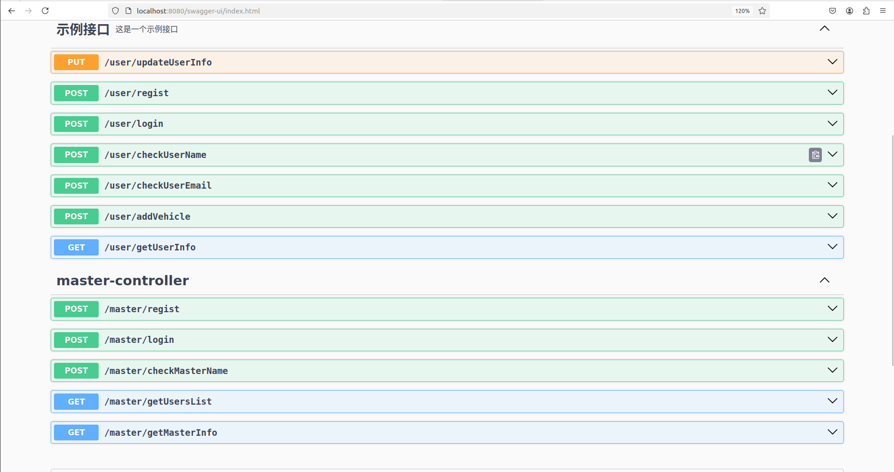

# SofeWarePratice(Parkinglot Management System)

## 整体设计概述

**系统功能按照角色划分为两大模块**：

1. 用户模块：面向普通用户，功能以查询、互动和个人信息管理为主。
2. 管理员模块：分权限级别，负责系统管理、反馈处理及数据分析。

### 功能模块设计

#### 用户模块
- [x] 用户注册与登录

    - [x] 注册：通过 UserController 提供用户注册接口，使用密码加密（如 BCrypt）。
    - [x] 登录：JWT（JSON Web Token）实现无状态身份认证。
- [ ] 停车场信息查询
    - [ ] 提供停车场列表和详情查询接口，包括停车位状态、价格、营业时间。
    - [ ] 附近设施查询：基于停车场坐标和设施坐标，通过地理计算（如 Haversine 公式）筛选附近设施。
- [x] 个人信息管理
    - [x] 提供用户信息更新接口（如修改邮箱、头像）。
    - [x] 车辆绑定：支持新增、修改或解绑车辆。
- [ ] 用户评论（反馈）
  用户对停车场或设施发表评论。
  支持多层评论（回复功能）。
- [ ] 管理员模块
  权限分级管理
  最高级管理员（Super Admin）：能创建、删除、管理低权限管理员。
  普通管理员：仅管理指定资源。
- [ ] 用户评论管理
  查看所有评论，回复用户反馈。
  支持批量操作（如隐藏违规评论）。
- [ ] 停车场和设施管理
  增删改查停车场信息（包括停车位数量、价格、位置）。
  管理便民设施（设施名称、状态、位置等）。
- [ ] 数据报表与分析
  生成停车场使用率统计报表。
  生成收益和停车流量报表。
  支持按时间维度（如每日、每月）导出数据。
## DataBase Used in This Troject
[本项目使用的数据库创建语句](./DevelopmentDOC/SoftWareTeamWork.sql)
### Interface Between Front and Backend 

[运行程序后于 http://localhost:8080/swagger-ui.html 查看接口文档](http://localhost:8080/swagger-ui.html)
